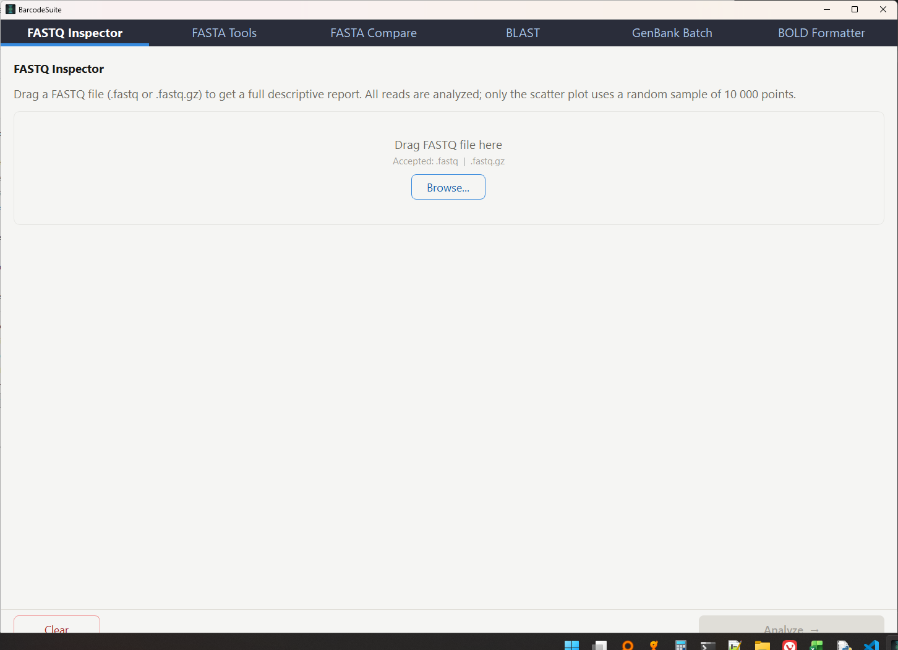
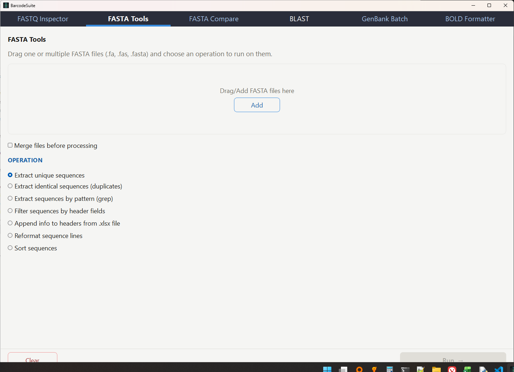
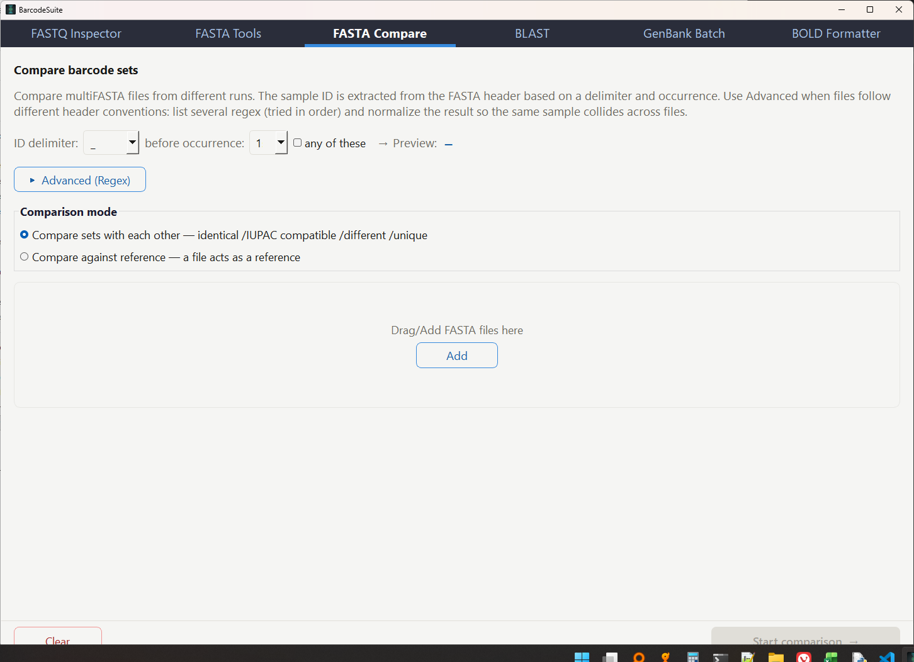
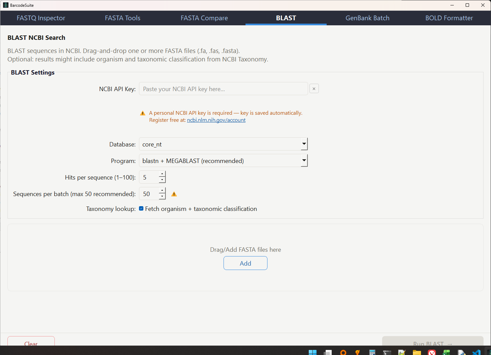
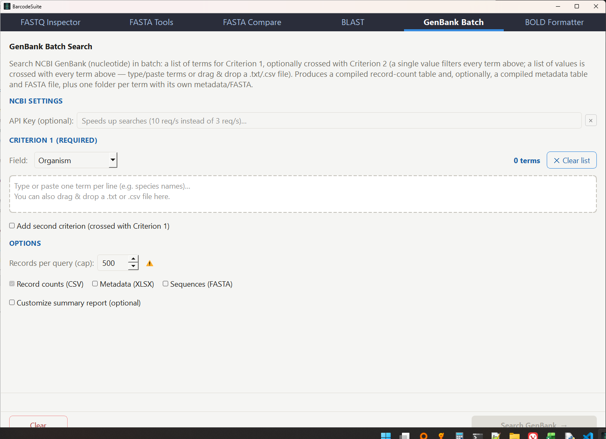

# BarcodeSuite

A graphical desktop suite of utilities for working with **FASTQ** and **FASTA**
files in *DNA barcoding* workflows. Compatible with outputs from ONTbarcoder /
Nanopore, BOLD and GenBank.

Built with PyQt5. Runs on Windows and other platforms; can also be distributed as
a standalone `.exe` (PyInstaller).

## Tools

The app opens a single window with six independent tabs:

| Tab | What it does |
| --- | --- |
| **FASTQ Inspector** | Full descriptive report of a FASTQ file: read counts, length stats (min/max/mean/median/N50), Phred quality, GC content and four distribution plots. |
| **FASTA Tools** | Seven operations on one or more FASTA files: extract unique / identical sequences, grep by header, filter by header fields, append info from `.xlsx`, reformat (wrap/unwrap) and multi-key sort. |
| **FASTA Compare** | Compares multiFASTA files from different runs sample by sample and classifies each sample as identical / IUPAC-compatible / different / unique. |
| **BLAST** | Online BLAST search of your sequences against NCBI databases, with optional taxonomy lookup. |
| **GenBank Batch** | Batch search in GenBank (nucleotide) with up to two crossed criteria; returns record counts (CSV), metadata (XLSX) and sequences (FASTA). |
| **BOLD Formatter** | Reformats the BOLD "Barcode ID" Excel workbook to the style of the BLAST results report. |

## Screenshots

| | |
| --- | --- |
|  |  |
| *FASTQ Inspector* | *FASTA Tools* |
|  |  |
| *FASTA Compare* | *BLAST NCBI Search* |
|  | |
| *GenBank Batch Search* | |

## Requirements

- Python 3
- `PyQt5`, `edlib`, `xlsxwriter`, `openpyxl`

```bash
pip install PyQt5 edlib xlsxwriter openpyxl
```

When run from source, the app checks these dependencies (and `pip` itself) at
startup and installs any that are missing automatically. This does not apply to
the packaged `.exe`.

## Running

```bash
python barcodeSuite.py
```

If an `icon.ico` file is present next to the script it is used as the window and
taskbar icon.

## Building a standalone executable

```bash
pip install pyinstaller
pyinstaller --noconsole --icon icon.ico --name BarcodeSuite barcodeSuite.py
```

The build is written to `dist/BarcodeSuite/`. Note that `openpyxl` loads some
submodules and data files dynamically, so you may need to add
`--collect-all openpyxl --hidden-import et_xmlfile` if the frozen app fails to
read `.xlsx` files.

## API keys

- **BLAST** requires a free NCBI API key (register at
  <https://www.ncbi.nlm.nih.gov/account/>). Paste it into the *NCBI API Key*
  field; it is saved to `_profiles/blast_config.json` for future sessions.
- **GenBank Batch** works without a key (~3 requests/sec); adding the same key
  raises the limit to ~10 requests/sec.

> **NCBI usage policy:** NCBI monitors and penalizes excessive use. Keep BLAST
> batches at ≤ 50 sequences and avoid multiple or very long simultaneous
> sessions.

## Documentation

A full user guide (English) is available at
[`guide/barcodeSuite_user_guide.html`](guide/barcodeSuite_user_guide.html).

## Project

Part of the ONTbarcoder v3.1b project.

## License

Copyright (C) 2026 Eduardo Tovar.

This program is free software: you can redistribute it and/or modify it under the
terms of the **GNU General Public License v3.0** as published by the Free Software
Foundation. See [`LICENSE`](LICENSE) for the full text.
