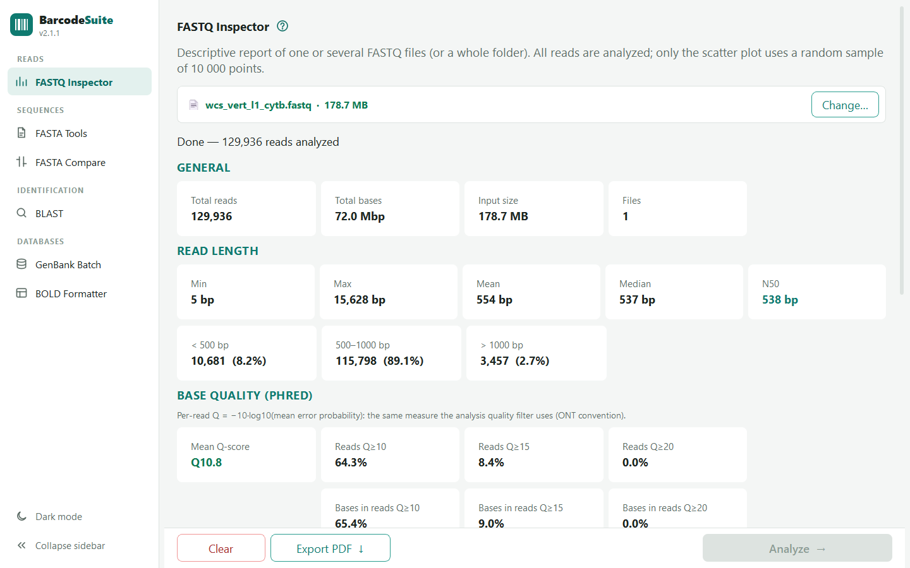
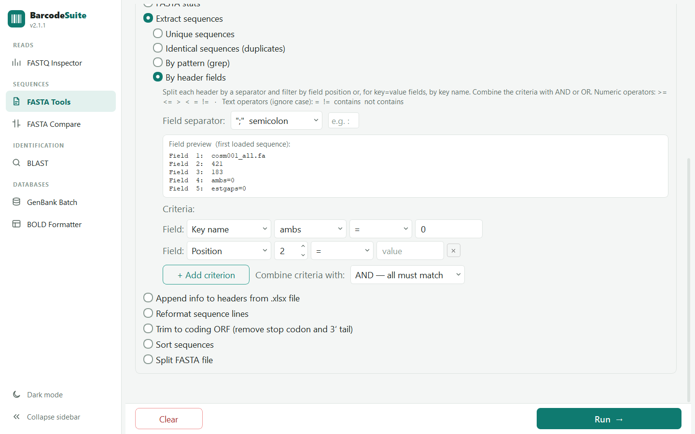
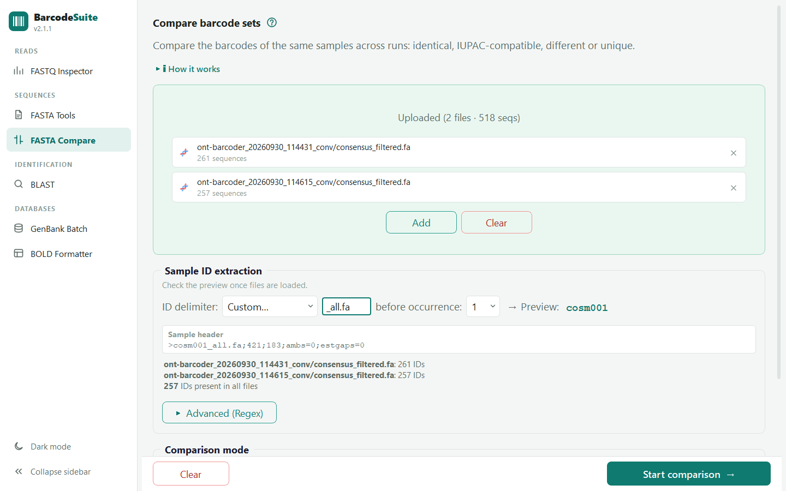
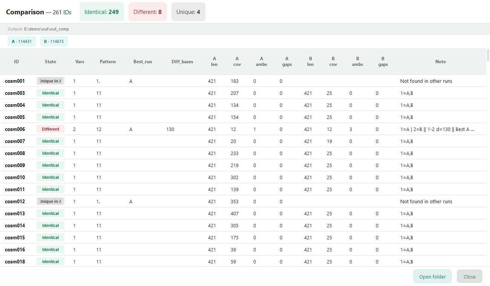
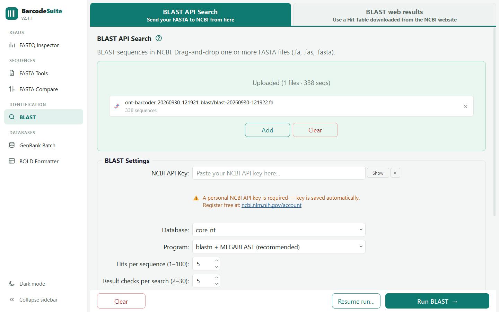
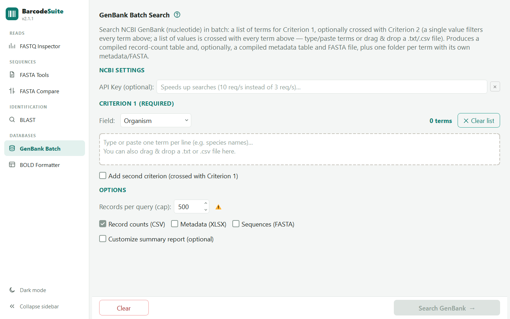
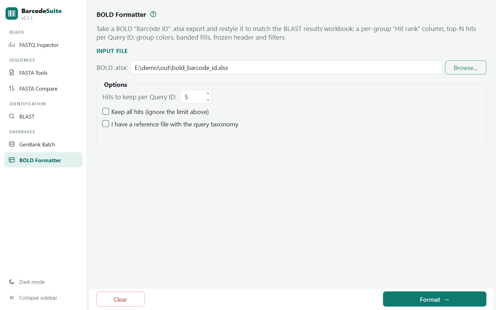
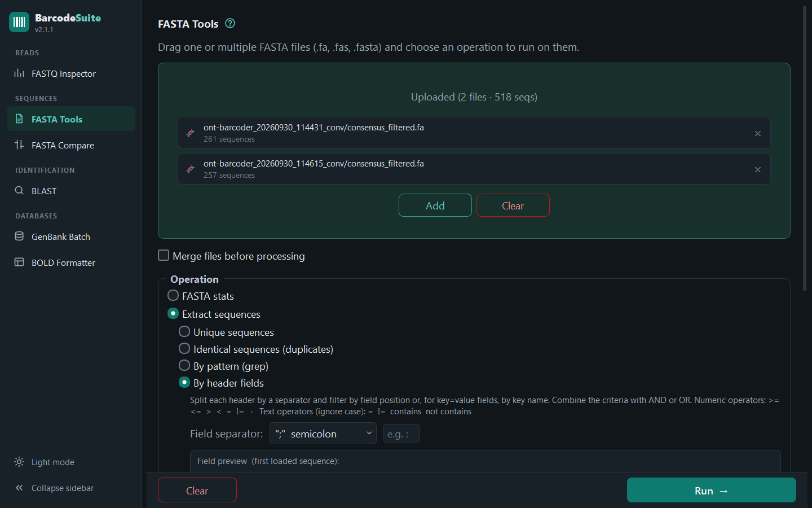
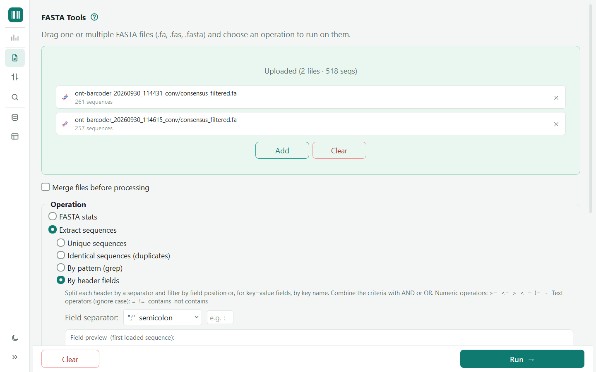

# BarcodeSuite

A graphical desktop suite of utilities for working with **FASTQ** and **FASTA**
files in *DNA barcoding* workflows. Compatible with outputs from ONTbarcoder /
Nanopore, BOLD and GenBank.

Built with PyQt5. Runs on Windows and other platforms; can also be distributed as
a standalone `.exe` (PyInstaller).

## Tools

The app opens a single window with six independent tools, listed in a sidebar:

| Tool | What it does |
| --- | --- |
| **FASTQ Inspector** | Quality report of one or more FASTQ files or a whole `fastq_pass/` folder: read counts, length stats (N50), Phred quality, GC content, per-group breakdown, plots and PDF export. |
| **FASTA Tools** | Operations on FASTA files: stats (with optional stop-codon check), extract sequences (unique, identical, grep, or by header fields with key names and AND/OR), append info from `.xlsx`, reformat, trim to coding ORF, multi-key sort and split (by count, size, length or header field). |
| **FASTA Compare** | Compares multiFASTA files from different runs sample by sample and classifies each sample as identical / IUPAC-compatible / different / unique, with an ID match summary and an option to ignore length differences at the ends. |
| **BLAST** | Online BLAST search against NCBI (API tab, resumable) or parsing of BLAST web result files (file tab), with taxonomy lookup, query-taxonomy reference, `Tax_level_match` and Summary / Best hit sheets in the results workbook. |
| **GenBank Batch** | Batch search in GenBank (nucleotide) with up to two crossed criteria; returns record counts (CSV), metadata (XLSX) and sequences (FASTA). |
| **BOLD Formatter** | Reformats the BOLD "Barcode ID" Excel workbook to the style of the BLAST results report. |

## Interface

Tools are grouped in a left sidebar (Reads, Sequences, Identification,
Databases). The sidebar can be collapsed to an icon rail (tool names show as
tooltips) with the button at its bottom or **Ctrl+B**, and the light / dark theme
is switched from the same place. Theme, sidebar state, the last open tool and the
window geometry are remembered between sessions.

A **?** next to each tool's title opens the matching section of the user guide in
the browser. The mouse wheel scrolls the page without changing the numeric fields
and drop-down lists under the cursor.

## Screenshots

| | |
| --- | --- |
|  |  |
| *FASTQ Inspector* | *FASTA Tools* |
|  |  |
| *FASTA Compare* | *Compare results* |
|  |  |
| *BLAST* | *GenBank Batch* |
|  |  |
| *BOLD Formatter* | *Dark theme* |
|  | |
| *Collapsed sidebar* | |

## Requirements

- Python 3
- `PyQt5`, `edlib`, `xlsxwriter`, `openpyxl`, `biopython`

```bash
pip install PyQt5 edlib xlsxwriter openpyxl biopython
```

When run from source, the app checks these dependencies (and `pip` itself) at
startup and installs any that are missing automatically. This does not apply to
the packaged `.exe`.

## Running

```bash
python barcodeSuite.py
```

If an `icon.ico` file is present next to the script it is used as the window and
taskbar icon.

## Building a standalone executable

```bash
pip install pyinstaller
pyinstaller --noconsole --icon icon.ico --name BarcodeSuite barcodeSuite.py
```

The build is written to `dist/BarcodeSuite/`. Note that `openpyxl` loads some
submodules and data files dynamically, so you may need to add
`--collect-all openpyxl --hidden-import et_xmlfile` if the frozen app fails to
read `.xlsx` files.

## Project layout

```
barcodeSuite.py      entry point: main window and worker wiring
suite_ui.py          sidebar, icons and light/dark theming
guide/               user guide (HTML) and its screenshots
tools/               make_screenshots.py regenerates guide/screenshots
_utilities/          utility panels, shared verbatim with ONTbarcoder3
  genbank_batch.py   GenBank Batch (BarcodeSuite only)
```

Every module in `_utilities/` except `genbank_batch.py` is a copy of the one in
ONTbarcoder3; to sync, copy the newer files over.

## API keys

- **BLAST** requires a free NCBI API key (register at
  <https://www.ncbi.nlm.nih.gov/account/>). Paste it into the *NCBI API Key*
  field; it is saved to `_profiles/blast_config.json` for future sessions.
- **GenBank Batch** works without a key (~3 requests/sec); adding the same key
  raises the limit to ~10 requests/sec.

> **NCBI usage policy:** NCBI monitors and penalizes excessive use. Keep BLAST
> batches at ≤ 50 sequences and avoid multiple or very long simultaneous
> sessions.

## Documentation

A full user guide (English) is available at
[`guide/barcodeSuite_user_guide.html`](guide/barcodeSuite_user_guide.html).

## Project

Version 2.1.1. Part of the ONTbarcoder3 project (utilities synced with ONTbarcoder3 3.7.1).

## License

Copyright (C) 2026 Eduardo Tovar.

This program is free software: you can redistribute it and/or modify it under the
terms of the **GNU General Public License v3.0** as published by the Free Software
Foundation. See [`LICENSE`](LICENSE) for the full text.
